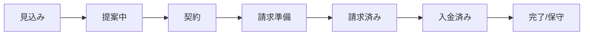
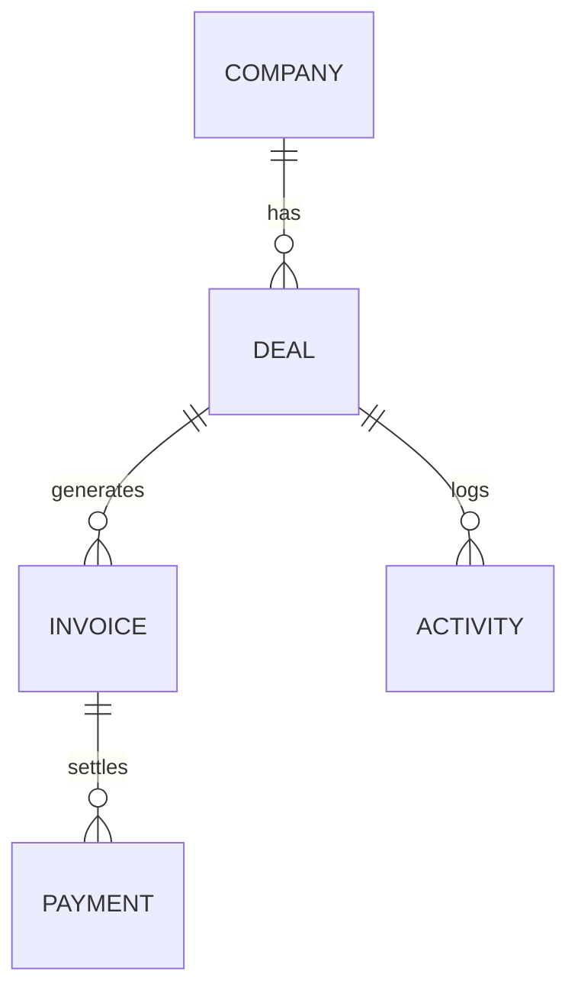

# ポートフォリオ第1弾：コンセプト案

## 1. 題材のアイデア出し

- アイデア1：**小さなチーム向け「案件〜請求ミニCRM」**  
  スプレッドシート＋Slack＋カレンダーに散らばった「案件の進捗」と「お金の流れ」を一元化し、請求漏れと状況把握コストを下げる題材。**採用。**
- アイデア2：**業務フロー健康診断の“見える化ダッシュボード”**  
  ヒアリング結果をもとに「詰まり箇所」「改善余地」「次アクション」を可視化する社内向けツール。第2弾候補。
- アイデア3：**ニュースレター／スポンサー運用のタスク・成果管理ツール**  
  発信・営業・スポンサー管理を一気通貫で追う題材。アイデア1の派生として将来拡張に回す。

---

## 2. 選択した題材の深掘り

### 題材選定の理由（なぜこのCRMにするか）

小さなチームの案件運営では、**「いま誰が何を持っていて、次に何をすべきか」と「いつ・いくら請求するか」**が、スプレッドシートや個人の記憶に埋まりやすいです。  
その結果、状況共有の往復・請求漏れの不安・月末の棚卸しが発生し、**“本来のクリエイティブ／顧客対応の時間が削られる”**という構造的な痛みになります。  
この題材は、ヨハク技研が強みにしている「業務フローの整流」と「運用が続く最小の仕組み化」をそのままプロダクト化でき、**発注側に価値が一言で伝わるため、1件目の受託獲得用の実績として最も相性が良い**と判断します。

### 解決したい課題（ペイン）

佐藤さんのペルソナに基づき、このアプリが解決する主要な課題（ペイン）を以下の3点に定めます。

1.  **案件管理の属人化:** 案件の最新状況が担当者の頭の中にしかなく、チーム全体で進捗を共有できていない。結果として、対応の遅れや引き継ぎの困難さを生んでいる。
2.  **情報の分散:** 案件に関するファイル、コミュニケーション、請求情報が別々のツールに散らばっており、全体像を把握するために多くの手間と時間がかかっている。
3.  **請求プロセスの非効率性とリスク:** 月末の請求作業が手動での確認に依存しており、時間がかかる上に、請求漏れや入金確認漏れといった事業上のリスクを常に抱えている。

### ターゲットペルソナ：佐藤 恵（サトウ メグミ）

|              |                                                                                                                                                          |
| ------------ | -------------------------------------------------------------------------------------------------------------------------------------------------------- |
| **氏名**     | 佐藤 恵 (Megumi Sato)                                                                                                                                    |
| **年齢**     | 38歳                                                                                                                                                     |
| **職業**     | 5人規模のデザインスタジオ「アトリエ・リヒト」共同経営者 兼 PM                                                                                            |
| **性格**     | クライアントからの信頼も厚く、丁寧な仕事ぶりが評価されている。細部まで気を配るがゆえに、自分で抱え込みすぎてしまう傾向がある。                           |
| **ITスキル** | Google Workspace (Gmail, Calendar, Drive, Sheets) は日常的に使用。Slackでのコミュニケーションもスムーズ。複雑な関数のスプレッドシートやGASの作成は苦手。 |

**業務内容と1日の流れ:**

*   **午前:** メールとSlackの確認、クライアントとの打ち合わせ（1〜2件）、デザイナーへのタスク割り振り。
*   **午後:** 案件の進捗確認、見積書作成、クライアントへのデザイン提案。夕方になると、翌日のタスク整理と請求関連の確認に追われる。
*   **常時5〜10件**のプロジェクトが異なるステータスで進行しており、頭の切り替えが大変。

**目標 (Goals):**

*   事務的な管理業務から解放され、クライアントワークやチームの創造性を高める活動にもっと時間を使いたい。
*   案件の進捗やお金の流れを、チームの誰が見ても分かる状態にしたい。
*   「請求漏れ」の不安から解放されたい。

**課題 (Pains):**

*   **案件管理が属人化している:**
    *   各案件の最新状況（ステータス、次のアクション、請求月など）が、スプレッドシートと佐藤さんの頭の中にしかない。
    *   他のメンバーが状況を把握しづらく、佐藤さんが休みだと業務が滞る。
*   **情報が分散している:**
    *   案件に関するやり取りはSlack、ファイルはGoogle Drive、請求情報は別のスプレッドシート...と情報がバラバラ。全体像を掴むのに時間がかかる。
*   **請求業務が非効率:**
    *   月末に、その月に請求すべき案件をスプレッドシートとカレンダーから洗い出す作業が発生。
    *   請求書を作成し、送付済みか、入金済みかを手動で更新するのが手間で、更新漏れも起きがち。

### 解決策のアイデア（どんなアプリか）

このSaaSのコンセプトは、以下の通りです。

**「散らばった案件情報と請求作業を一つにまとめ、チームの誰もが安心してお金の流れを管理できる、小さなチームのためのCRM」**

このコンセプトは、以下の価値を提供することを約束します。

*   **情報の集約:** スプレッドシート、チャット、カレンダーに散らばっていた情報を一元管理する。
*   **プロセスの可視化:** 案件の発生から入金まで、ステータスを誰もがリアルタイムに追跡できるようにする。
*   **リスクの低減:** 請求漏れや確認漏れといった、手作業によるミスを防ぐ。

### 導入前 / 導入後の変化（Before / After）

* **月末の請求棚卸し**：スプレッドシートとカレンダーを見比べて2〜3時間 → **請求準備中の案件が自動で並び、15分で確認完了**。
* **進捗確認の往復**：Slackで「この案件どうなってる？」が頻発 → **一覧で“誰ボールか／次アクション”が見え、自己解決**。
* **請求漏れの不安**：担当者の記憶と手動チェックに依存 → **ステータス遷移＋リマインドで“漏れない仕組み”へ**。

### 設計のポイント（ヨハク技研らしさ）

1. **「誰が次のボールを持つか」を必ず可視化するステータス設計**  
   業務が止まる原因を“ボールの宙づり”と捉え、一覧と詳細の両方で次アクションを明確化する。
2. **請求タイミングの“抜けやすさ”を前提に、最小の自動化を挟む**  
   「請求準備中／請求済み」の抽出、締切前の通知（Slack/メール想定）など、運用が続く範囲で自動化する。
3. **入力項目を削り、5人チームの運用に最適化するUI**  
   PMが“抱え込みすぎない”ことを支えるため、登録・更新の手数と迷いを最小化する。

### MVPスコープ（第1弾で実装する範囲）

* 取引先（Company）、案件（Deal）、請求（Invoice）、活動ログ（Activity）の**CRUD**。
* 案件ステータスの遷移（見込み→提案中→契約→請求準備→請求済み→入金済み）。
* ダッシュボードの主要KPI（今月の見込み売上、請求予定、要対応案件）。
* 一覧の検索・フィルタ（請求予定月／ステータス／担当者）。
* 請求予定の簡易リマインド（UI上のアラート、通知の想定だけでも可）。

### 今回はやらないこと（非スコープ）

* 権限の細分化・監査ログなどのエンタープライズ要件。
* 会計ソフト／外部CRMとの本格連携。
* PDF請求書の自動生成や電子契約連携。
* フルレスポンシブ／全状態の網羅的テスト（デモ用途に必要な範囲に限定）。

### 業務フローとデータ構造（1枚図）

**案件 → 請求 → 入金の状態遷移**

**主要テーブルの関係**

### このプロジェクトでアピールしたいスキル

このポートフォリオを通じて、以下のスキルセットを証明します。

*   **業務理解と課題発見能力:** 実際のビジネス課題（特にBtoBのお金の流れ）を深く理解し、解決策を提案できる。
*   **UX/UI設計能力:** 複雑な業務フローを、シンプルで直感的なUI/UXに落とし込むことができる。
*   **Webアプリケーション開発能力:** React(Next.js)を用いたフロントエンド実装、およびバックエンドとの連携（API通信）を含む、実践的な開発スキル。

### 想定する技術スタック（任意）

*   **フロントエンド:** Next.js (React), TypeScript, Tailwind CSS
*   **バックエンド:** Supabase (BaaS) または Node.js (Express)
*   **DB:** PostgreSQL (Supabase経由)
*   **その他:** Figma (デザイン), Vercel (デプロイ)

---

## 3. 画面のざっくり構成 (4画面)

このCRMのコア体験を構成する、主要な画面を以下のように定義します。

### 1. ホーム画面（ダッシュボード）

*   **目的:** ログインしたユーザー（佐藤さん）が、「今日やるべきこと」と「事業の全体像」を瞬時に把握できるようにする。
*   **主要な要素:**
    *   **要対応タスク:** 「今週が請求予定の案件」「アクションが必要な案件」などをリスト表示。
    *   **重要指標 (KPI):** 「今月の見込み売上」「契約済み・請求済み案件の件数」などをカード形式で表示。
    *   **最近の活動:** チーム全体の最近の更新履歴（メモの追加など）を表示。

### 2. 案件一覧画面

*   **目的:** すべての案件を俯瞰し、ステータスや担当者で絞り込んで状況を確認できるようにする。佐藤さんの「あの案件どうなってるんだっけ？」を解消する。
*   **主要な要素:**
    *   **案件テーブル:** 案件名、クライアント、金額、ステータス、担当者、更新日などの列を持つ。
    *   **検索・フィルタ機能:** 「請求準備中の案件」「A社に関連する案件」などで動的に絞り込みができる。
    *   **新規案件登録ボタン**

### 3. 案件詳細画面

*   **目的:** 特定の案件に関するすべての情報を集約する「唯一の場所」を提供する。情報の分散を防ぐ。
*   **主要な要素:**
    *   **案件ヘッダー:** 案件名、クライアント名、金額、現在のステータスを表示。
    *   **ステータス管理:** ステータスを変更するプルダウンやボタンを配置。（例：「提案中」→「契約」）
    *   **コミュニケーション履歴:** 過去のやり取りや議事録を時系列で記録・表示するメモ機能。

### 4. 案件登録・編集フォーム

*   **目的:** ストレスなく、直感的に案件情報を登録・更新できるようにする。
*   **主要な要素:**
    *   案件名、クライアント名、見込み金額、担当者、請求予定月など、必要最小限の入力フィールド。
    *   入力ミスを防ぐためのドロップダウン選択（ステータス、担当者など）。

いいですね、いよいよ「実物をつくる」フェーズですね。

ブランドブリーフや自己分析の内容を前提にすると、
**「小さなチームの“お金と仕事の流れ”を整理する業務Webアプリ」**が、ヨハク技研らしさと案件獲得の両方に一番ハマります。

なので、題材は CBO視点ではこれを推します：

---

## 題材の結論

### 題材：スポンサー / 案件 〜 請求管理ミニCRM

（ざっくりいうと「商談〜請求漏れをなくすための、業務用ミニSaaS」）

---

## なぜこれが一番 “おいしい題材” か

### 1. ヨハク技研の世界観とずれていない

内部ドキュメントでも何度か出てきている

* 「スポンサー〜請求」
* 「ニュースレター運用などの業務ブロック」

の流れと直結しています。

＝**もともとやろうとしていた自動化パッケージの中身を、
「業務系Webアプリ」というラベルで切り出しただけ**なので、ブレがありません。

---

### 2. クライアントにとって「価値が直感的」＝営業しやすい

スポンサー / 案件 〜 請求の題材だと、ペインが一言で伝わります。

* どの案件がどこまで進んでいるか分かりづらい
* 誰が次にボールを持つべきか曖昧
* 請求漏れ・請求遅れが怖い

→ ここを「こうスッキリさせます」と言えるので、
**ポートフォリオを見た相手が自分ごと化しやすい**。

これは「タスク管理アプリ」や「なんとなくのダッシュボード」よりも、
お金に直結しているぶん説得力が高い題材です。

---

### 3. 少ない画面数で、業務系UIの“おいしいところ”が一通り見せられる

この題材なら、3〜5画面で下記をすべて含められます。

* 一覧画面

  * 案件名 / クライアント名 / 金額 / ステータス / 担当者 / 期限
  * 絞り込み・検索（例：今月請求予定の案件だけ）
* 詳細画面

  * コミュニケーション履歴（メモ）
  * ステータス履歴
  * 見積・請求書リンク
* 編集フォーム

  * 金額 / 期日 / ステータス / 担当者などの入力
* ホーム（ダッシュボード的なもの）

  * 今月の見込み売上
  * 今週のToDo（請求予定・フォローすべき案件）

＝「業務系Webアプリの典型UIパターン」を、
**ひとつの題材でまとめて見せられる**のが大きいです。

---

### 4. 実装も現実的で、汎用性も高い

データ構造はシンプルです：

* Company（取引先）
* Deal / Project（案件）
* Invoice（請求）
* Activity（メモ・連絡履歴）

なので、

* フロント：React / Next
* バックエンド：Rails / Node など
* DB：PostgreSQL

あたりで、**モック＋最低限CRUDを実装するのに丁度いい複雑さ**です。

しかもこの構造は、

* 案件管理
* 営業パイプライン
* 内部プロジェクト管理

などにもそのまま横展開できます。

＝**この題材で作ったUIシステムとデータ設計は、そのまま今後の受託にも使い回せる**投資になります。

---

## この題材で進めるときの「ざっくり設計イメージ」

ここから先はもう実装フェーズですが、イメージだけ置いておきます。

1. ペルソナ

   * 例：小さなメディア / ポッドキャスト / スタジオの運営者 or 営業担当
   * 週のうち数時間をスポンサー・案件対応に使っている人

2. ペイン

   * 案件ごとの進捗がスプレッドシートでぐちゃっとしている
   * 誰が次に動くか分からず、ボールが宙に浮きがち
   * 請求タイミングをカレンダーや頭の中で管理している

3. このSaaSの約束

   * 「案件〜請求の流れを一本の画面で追えるようにして、請求漏れとモレモレ営業をなくす」

4. UX要素

   * ステータス：見込み → 提案中 → 契約 → 請求準備 → 請求済み → 入金済み
   * 一覧画面で「今週の請求予定」「フォローすべき案件」が一目でわかる
   * 詳細画面で、やりとり履歴と金額・期日がまとまって見える

---

## まとめ

なので、題材としては：

> **「スポンサー / 案件 〜 請求管理ミニCRM（商談〜請求漏れ防止アプリ）」**

で進めるのが、ヨハク技研のブランドと
「キャッシュが尽きる前に1件目の受託を取る」という現実目標の、両方に一番フィットします。

---

## 最終アウトプット（受託営業用の提出物）

この題材を“実績として最大限活用する”ため、最終的に以下を揃える。

1. **コンセプトシート（本ドキュメント要約・1枚）**  
   ペルソナ／ペイン3つ／Before-After／設計ポイント3つを一枚にまとめる。
2. **UIスクリーンショット4枚＋各1行の設計意図**  
   ホーム／一覧／詳細／編集フォーム。どのペインをどう解いたかが伝わるコメントを添える。
3. **2分程度の簡易デモ動画（モックでOK）**  
   「案件登録→ステータス更新→請求予定の確認→入金完了まで」の流れを通して見せる。
4. **想定技術構成・アーキテクチャ図1枚**  
   `docs/drafts/portfolio-strategy-memo.md` の構成に沿って、フロント／バック／DB／通知連携の箱と矢印を描く。
5. **README（スコープと成果の明文化）**  
   MVP範囲・非スコープ・狙った改善（Before/After）を短く記載し、受託時の見積り・再現性に繋げる。

次のステップは、この題材を前提に

* ペルソナ
* ペイン（3つ）
* このSaaSの一言コンセプト
* 画面（3〜5枚）のざっくり構成

をここで一緒に固めてしまうと、そのまま実装に入れる状態になります。
