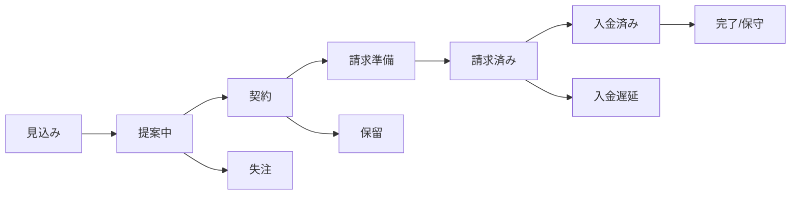
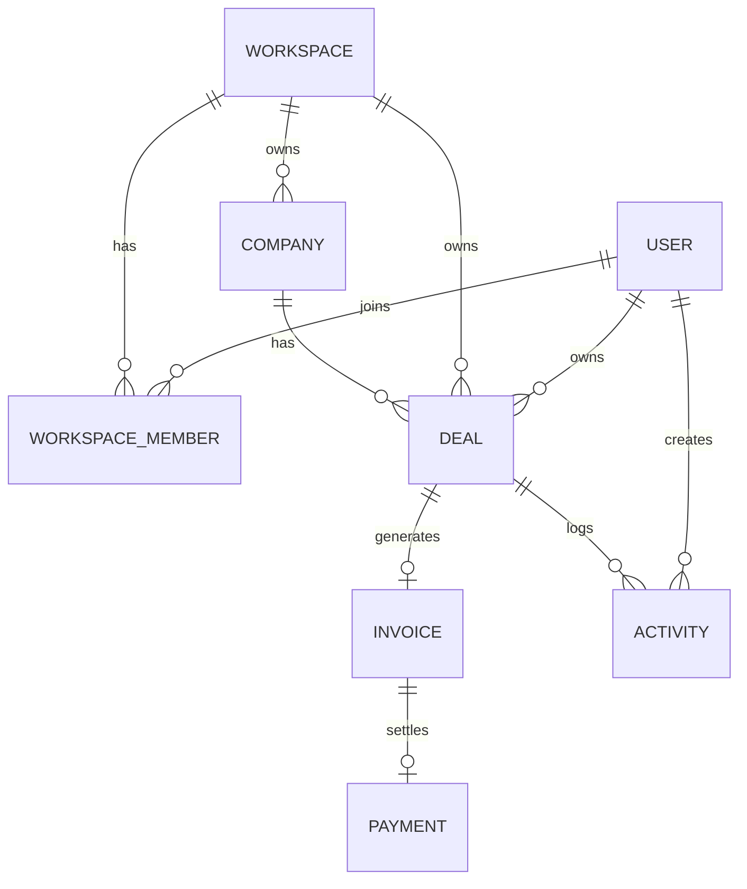

# ミニCRM（案件〜請求）MVP仕様書（ポートフォリオ版）v0.1

> **設計思想（最重要）**：作る前に「運用が回るルール」を確定し、プロダクトはその運用を“迷いなく・抜けなく・続けられる”形に整える。

---

## 0. 概要

### 0.1 One-liner
散らばった案件情報と請求作業を一つにまとめ、**小さなチームが安心して「仕事とお金の流れ」を追える**ミニCRM。

### 0.2 対象ユーザー
- 5人前後の小さなチーム（制作/メディア/スタジオ/受託など）
- 月に 5〜10 件の案件が並走する
- Slack/メール/カレンダー/Drive は既存のまま使い続ける

### 0.3 解決したい課題（Before / After）
- 月末棚卸し：2〜3時間 → **15分を目指す**（※前提条件あり）
- 進捗確認：Slack往復 → **一覧で自己解決**
- 請求漏れ：記憶と手動 → **状態遷移 + UIアラート**
- 例外対応：原因調査に時間 → **バリデーション + 履歴で即復帰**

### 0.4 Assumptions（前提）
- 同時進行：5〜10案件 / 月
- 請求形態：分割入金は扱わない（Non-scope）
- **MVP制約：1案件につき請求は原則1件（複数請求/分割請求はNon-scope）**
- 連携：外部ツールは取り込まず、リンク参照（Reference-first）
- 目的：棚卸し“作業”の最小化（数値は運用・定着で変動）

---

## 1. MVPスコープ

### 1.1 MVPで作る（Build）
- **Company / Deal / Invoice / Activity** の CRUD
- ステータス遷移（見込み→提案中→契約→請求準備→請求済み→入金済み→完了/保守）
- **条件付き必須**（例：請求準備へ遷移するなら「請求予定月」「請求先」必須）
- 関連リンクの集約（レベル1：リンク + 要点メモ）
- ダッシュボードKPI
- 検索・フィルタ（ステータス / 担当 / 請求予定月 / クライアント）
- UIアラート（通知連携は“想定”でも可）

### 1.2 今回はやらない（Non-scope）
- 権限の細分化・エンタープライズ要件（高度な監査、詳細な承認フローなど）
- 会計ソフト/外部CRMとの本格連携
- PDF請求書の自動生成、電子契約連携
- 完全統合（レベル3）
- フルレスポンシブ、全状態の網羅的テスト（デモ用途に必要な範囲に限定）

---

## 2. 設計原則（DESIGN FOR CONTINUITY）

1. **次のボール（誰が持つか）を必ず可視化**する
2. 抜けやすい請求タイミングに**最小の自動化（UIアラート）**を挟む
3. **状態遷移 + バリデーション**で「抜けない更新」
4. **入力項目を削り**、5人チーム運用に最適化

---

## 3. 運用モデル（Operating Rules）

### 3.1 Single Source of Truth
- 案件の「正」は **Deal Detail（案件詳細）** に置く
- やり取り（Slack/メール等）は取り込まない
- 代わりに **リンク + 要点メモ**で紐づける（Reference-first）

### 3.2 Update Triggers（イベントが起きたら更新）
以下が発生したら、担当者は当日中（遅くとも翌営業日）に更新する。
- 見積送付
- 契約締結
- 着手
- 検収（納品/OK）
- 請求発行
- 入金確認

### 3.3 週次・月次の基本運用
- 週次（10分）
  - Deal List をフィルタ（「要対応」「今週期限」「請求準備」）
  - “次アクション未設定” をゼロにする
- 月次（15分を目標）
  - Dashboard / Deal List の「請求予定月=当月」を確認
  - 「請求準備」→「請求済み」への遷移漏れを潰す

### 3.4 支払い条件（日本の一般的パターンを踏まえた初期値）
- MVPの標準：**月末締め・翌月末払い（サイト約30日）**
- 初期値ロジック：Invoice作成時に **請求日（invoice_date）** を入力すると、**入金期日（invoice_due_date）** を「請求日の翌月末」に自動セット（ユーザーは上書き可能）
- 期日が土日祝の場合：運用上は**翌営業日入金**を許容（MVPでは表示上の期日は保持し、アラート判定は“翌営業日”を前提にできるよう拡張余地を残す）

---

## 4. 状態遷移（Flow）

### 4.1 Dealステータス
- 見込み
- 提案中
- 契約
- 請求準備
- 請求済み
- 入金済み
- 完了/保守

### 4.2 例外ステータス（一覧で追える）
- 保留
- 失注
- 入金遅延（フラグ or 状態）

### 4.3 遷移ルール（条件付き必須）
- 見込み → 提案中：提案日（任意）、担当者（必須）
- 提案中 → 契約：契約日（必須）、契約金額（必須）
- 契約 → 請求準備：請求先（必須）、請求予定月（必須）
- 請求準備 → 請求済み：請求日（必須）、請求金額（必須）
- 請求済み → 入金済み：入金日（必須）、入金金額（必須）
- 入金済み → 完了/保守：完了日（任意）

### 4.4 Mermaid（図）

---

## 5. データモデル（Data）

> 以降のUI（テーブル/サイドバー）は、ここで定義するオブジェクト構造を唯一のソースとして参照する。

### 5.1 ER（MVP）

### 5.2 テーブル定義（最小）

#### WORKSPACE（利用組織）
- id
- name（必須）
- created_at / updated_at

#### USER
- id
- email（必須・ユニーク）
- display_name（必須）
- created_at / updated_at

#### WORKSPACE_MEMBER
- id
- workspace_id（必須）
- user_id（必須）
- role（admin / member のいずれか）
- status（invited / active）
- created_at / updated_at

#### COMPANY（取引先）
- id
- workspace_id（必須）
- name（必須）
- owner_user_id（任意）
- notes（任意）
- created_at / updated_at

#### DEAL（案件）
- id
- workspace_id（必須）
- company_id（必須）
- title（必須）
- status（必須）
- owner_user_id（必須）

- amount_expected（任意：JPY・整数）
- amount_contract（契約で必須：JPY・整数）
- contract_date（契約で必須）
- due_date（任意：案件全体の期限）

- next_action_text（必須）
- next_action_owner_user_id（必須）
- next_action_due_date（必須）

- invoice_planned_month（請求準備で必須：YYYY-MM）
- billing_to_name（請求準備で必須）

- links[]（任意：URL+ラベル）
- created_at / updated_at

#### INVOICE（請求）
- id
- workspace_id（必須）
- deal_id（必須・ユニーク）※MVPは **1 deal = 1 invoice（原則）**
- invoice_date（請求済みで必須）
- amount_invoice（請求済みで必須：JPY・整数）
- invoice_due_date（請求済みで必須：入金期日）
  - **自動初期値**：invoice_date を基準に「翌月末」をセット（上書き可）
- status（draft / issued / paid）※MVPは issued / paid の運用でも可
- note（任意）
- created_at / updated_at

#### PAYMENT（入金）
- id
- workspace_id（必須）
- invoice_id（必須・ユニーク）※MVPは **1 invoice = 1 payment（原則）**
- paid_date（入金済みで必須）
- amount_paid（入金済みで必須：JPY・整数）
- created_at

#### ACTIVITY（履歴）
- id
- workspace_id（必須）
- deal_id（必須）
- type（memo / link_added / status_changed / invoice_updated など）
- body（必須）
- created_by_user_id（必須）
- created_at

### 5.3 監査の最低限
- Deal / Invoice の **更新履歴**（誰が・いつ・何を変えたか）を Activity で残す

---

## 6. 画面構成（App Shell + Pages）

### 6.0 アプリ全体レイアウト（固定）
- **左：Navigation Sidebar（常時表示）**
  - 画面遷移と運用ショートカット（Quick Filters）を担う
- **右：Main Content（ページ本体）**
  - 選択中のページ（Dashboard / Deals / Invoices / Form など）を表示
  - ページ内で必要に応じて「一覧→詳細」を完結させる

> 重要：本MVPの基本形は **App Shell（左ナビ + 右ページ）**。右側に常設の第2サイドバーは置かない。案件詳細は「ページ内のInspector（右ドロワー/パネル）」として、必要なときだけ表示する。

### 6.1 Dashboard
**目的**：今日やるべきことと、事業の全体像を瞬時に把握。
- 要対応（次アクション期限切れ / 今週期限 / 入金遅延）
- KPI（今月見込み売上、請求予定、契約中件数）
- 最近の活動（更新履歴）

### 6.1 ダッシュボード（ページ）
**目的**：今日やるべきことと、全体の危険信号をすばやく把握する。

#### 6.1.1 構成（固定）
- Alert Summary Cards（件数カード）
  - 未入金（遅延）/ 入金期限まもなく / 今月：未請求 / 対応期限切れ
  - クリックで「案件ページ」へ遷移し、Filter Bar に同期
- KPI Cards（仮）
  - 今月：請求予定件数 / 未回収合計（任意）/ 契約中件数（任意）

#### 6.1.2 Recent Activity（直近1週間の更新案件：テーブル表示）
**目的**：最近動いた案件を“一覧で”把握し、追い漏れを防ぐ。
- 対象：**直近7日間**に更新（Deal または請求/入金の更新）された案件
- 表示：通常のDataTable形式（スクロール可能）
- ソート：更新日（updated_at）降順
- 行操作：**案件名クリック**で Deal Inspector を開く

**表示カラム（固定）**
- 更新日（updated_at）
- Alerts（最上位 + +n）
- 案件名（title）
- 取引先（company）
- ステータス（status）
- 担当（owner）
- 最終更新内容（last_activity_summary：例「請求済みに更新」「次アクション期限を変更」）

### 6.2 案件（一覧）
**目的**：俯瞰と自己解決。
- テーブル列：案件名 / 取引先 / 金額 / ステータス / 担当 / 次アクション / 期限 / 更新日
- 検索・フィルタ：ステータス、担当、請求予定月、取引先
- クイックアラート：
  - 次アクション未設定
  - 期限切れ
  - 当月請求なのに「請求準備」未完
  - 期日接近（入金期日まで3営業日以内）
  - 入金遅延（入金期日超過）
- 操作：行クリックで **Deal Inspector（ページ内の右ドロワー）** を開く（一覧の文脈を保ったまま確認・更新）

#### 6.2.1 フィルタUI（上部：固定）
- 上部に **Filter Bar** を常設（ページ内で現在の絞り込み状態が一目で分かる）
  - スコープ：Workspace（固定）
  - 主要フィルタ：ステータス / 担当 / 請求予定月
  - アラートフィルタ：未入金（遅延）/ 対応期限切れ / 入金期限まもなく / 今月：請求予定 / 来月：請求予定 / 今月：未請求
  - 検索：案件名（title）

#### 6.2.2 左ナビQuick Filtersとの同期（固定）
- 左ナビの Quick Filter を選択すると、Dealsページに遷移し **Filter Bar の状態が同期**される
- Dealsページ上で Filter Bar を変更すると、左ナビ側の選択状態も同期される（active quick_filter を更新）
- 同期の優先順位：
  1) 左ナビ Quick Filter
  2) Dealsページの Filter Bar
- フィルタの表現：
  - Quick Filter 選択時は、Filter Bar 上に **チップ（Pill）**として表示（ワンクリックで解除可能）
  - 複数フィルタは AND 条件で適用（ただし Quick Filter は単一選択）

### 6.3 Deal Detail（詳細：唯一の場所）
**目的**：案件の「正」を一箇所に集約。
- ヘッダー：案件名 / 取引先 / 金額 / 現在ステータス
- ステータス更新（遷移時に条件付き必須チェック）
- 次アクション編集（テキスト・担当・期限）
- 請求情報（予定月、請求日、金額、入金日、金額）
- リンク集約（Slackスレ/Drive/Calendar/見積/請求書など）
- Activity タイムライン（メモ/変更履歴）

### 6.4 Form（登録・編集）
**目的**：迷いなく登録。
- Deal作成：取引先、案件名、担当、ステータス、次アクション（必須）
- 選択式（ステータス、担当）
- 入力を段階化（必要になるまで見せない）

### 6.5 Navigation Sidebar（左：ナビゲーション）
**目的**：迷わず移動し、日々の運用導線を固定する。

#### 6.5.1 構成（上から）
1. **Workspace Switcher**
   - Workspace名
   - 切替（将来対応。MVPは単一WorkspaceでもUI枠は置く）
2. **Primary Nav（固定）**
   - ダッシュボード（key: dashboard）
   - 案件（key: deals）
   - 請求（key: invoices）
3. **Quick Filters（運用ショートカット）**

   **並び順（固定）**：緊急 → 予防 → 月次 → 漏れ防止
   1) 未入金（遅延）
   2) 対応期限切れ
   3) 入金期限まもなく
   4) 今月：請求予定（請求予定月=当月）
   5) 来月：請求予定（請求予定月=翌月）
   6) 今月：未請求

   **適用ルール（固定）**
   - Quick Filter をクリックすると、ナビは自動で **Deals** に遷移し、Dealsページのフィルタが即時適用される
   - 「今月請求 / 来月請求」は **invoice_planned_month** による絞り込み（請求対象の棚卸しを速くする）
   - 「今月：未請求」は、当月請求のうち **未請求（invoice.status が issued/paid でない）** を強調するための別フィルタ

4. **Primary Action**
   - ＋ 新規案件（Deal作成）
5. **User Menu**
   - ユーザー名
   - 設定（MVPは最小）/ ログアウト

### 6.3 請求（一覧）
**目的**：回収（未入金/期日接近/遅延）を、請求単位で棚卸しする。

#### 6.3.1 請求テーブル（Invoices Table）
- 1行 = 1請求（Invoice）
- 主に見るもの：入金期日 / 未回収 / 状態
- 行操作：案件名クリックで Deal Inspector を開く（請求の更新はInspectorで完結）

**表示カラム（固定）**
- Alerts（未入金（遅延）/ 入金期限まもなく：最上位 + +n）
- 取引先（company）
- 案件名（deal.title）
- 請求状態（invoice.status：issued/paid）
- 請求日（invoice_date）
- 入金期日（invoice_due_date）
- 未回収額（amount_outstanding）
- 請求金額（amount_invoice）
- 入金日（paid_date：paidの場合）
- 担当（deal.owner）
- 更新日（updated_at）

#### 6.3.2 フィルタ（最小）
- 状態：issued / paid
- 期日：入金期日レンジ
- 取引先 / 担当
- アラート：未入金（遅延） / 入金期限まもなく

#### 6.3.3 Dealsテーブルとの役割分担（固定）
- **案件（Deals）テーブル**：案件の進捗と「次の一手」を回す（案件単位）
- **請求（Invoices）テーブル**：回収と期日を回す（請求単位）

### 6.6 Deal Inspector（ページ内：インスペクタ/ドロワー）
**目的**：一覧の文脈を維持したまま、最短で“運用に必要な更新”を完了する。
- 表示トリガー：Deals DataTable の **案件名（title）クリック**
- 役割：
  - **確認**（案件の現状・次アクション・請求/入金の危険信号）
  - **更新**（ステータス遷移、次アクション、請求/入金の主要項目）
- 役割：
  - **確認**（案件の現状・次アクション・請求/入金の危険信号）
  - **更新**（ステータス遷移、次アクション、請求/入金の主要項目）

### 6.6.1 レイアウト方針（固定）
- Deal Inspector は **右から出るページ内ドロワー**（オーバーレイ）
- ドロワー上部は **ヘッダー（固定）**
  - 閉じる（×）
  - 最上位アラート（表示ラベル）＋残数（+n）
  - 案件の同定情報：案件名 / 取引先 / ステータス（編集可）

### 6.6.2 推奨アクション文（固定）

#### 6.6.2.1 位置
- 推奨アクション文は **案件名ブロックの直下（=最上部で、かつ文脈が分かる位置）** に表示
  - 理由：まず「どの案件か」を即時に同定 → 次に「いま何をすべきか」を提示、の順が迷いが少ない

#### 6.6.2.2 表示形式
- **1行（最大2行）**の短文（現場の言い回し）
- 先頭に「👉」などの軽い記号は可（強すぎる警告表現は避ける）
- 右端に任意で **「次アクションにセット」**（ワンクリック反映）
  - MVPはボタン無しでも可（テキストのみでも成立）

#### 6.6.2.3 生成ルール
- 成立しているアラートのうち、**優先順位が最上位のもの**に対応するテンプレを採用する
- テンプレは「推奨行動（文）」と「次アクションへの反映案（任意）」で構成

#### 6.6.2.4 テンプレ（表示ラベル別：固定）

> トーン：**です/ます調**、強い命令は避け、優しい上司の声かけのように「次の一手」が自然に分かる表現にする。

共通：
- 推奨アクション文は **1行（最大2行）**
- 右端の **「次アクションにセット」** を押すと、下記の初期値で next_action を上書きする（固定）
- 期日の初期値は原則 **翌営業日**（土日除外。祝日はP1）

1) **未入金（遅延）**
- 推奨行動（表示文）：
  - `👉 まだ未入金のようです。入金予定を確認して、必要ならご連絡しておきましょう（期日: {invoice_due_date} / 実効: {effective_due_date} / {overdue_days}日超過）`
- 次アクションにセット（初期値・固定）：
  - text：`入金予定の確認（遅延）`
  - owner：`deal.owner`
  - due_date：`翌営業日`

2) **入金期限まもなく**
- 推奨行動（表示文）：
  - `👉 入金期限が近いです。念のため、入金予定の確認をお願いします（期日: {invoice_due_date} / 実効: {effective_due_date} / あと{due_soon_business_days}営業日）`
- 次アクションにセット（初期値・固定）：
  - text：`入金予定の確認`
  - owner：`deal.owner`
  - due_date：`翌営業日`

3) **今月：未請求**
- 推奨行動（表示文）：
  - `👉 今月分が未請求のようです。請求書の作成→発行まで進めておきましょう（{invoice_planned_month}）`
- 次アクションにセット（初期値・固定）：
  - text：`請求書の作成・発行（今月分）`
  - owner：`deal.owner`
  - due_date：`翌営業日`

4) **対応期限切れ**
- 推奨行動（表示文）：
  - `👉 対応期限が過ぎています。次の一手（内容/担当/期限）を更新しておきましょう（期限: {next_action_due_date} / {overdue_days}日超過）`
- 次アクションにセット（初期値・固定）：
  - text：`次の一手を更新`
  - owner：`deal.next_action.owner（現状維持）`
  - due_date：`翌営業日`

### 6.6.3 フィールド順（固定：DataTable順を縦に踏襲）
> DataTableの並び順を、Inspector内のフォーム順として踏襲する（一覧→詳細で迷わせない）。
> ただし「請求/入金」の実務で必須になる追加項目（請求先・請求日・入金日など）は、同じBillingブロック内で **補助フィールド**として表示する。

1) Alerts（表示のみ：最上位 + +n、詳細はTooltip/展開）
2) 案件名（title）
3) 取引先（company）
4) ステータス（status）
5) 担当（owner）
6) 次アクション（next_action_text）
7) 次アクション担当（next_action_owner）
8) 次アクション期限（next_action_due_date）
9) 請求予定月（invoice_planned_month）
10) 請求状態（invoice.status）
11) 入金期日（invoice_due_date）
12) 請求金額（amount_invoice）
13) 未回収額（amount_outstanding：計算値）
14) 更新日（updated_at：表示のみ）

**Billing補助フィールド（Inspectorのみ）**
- 請求先名（billing_to_name）※「請求済みにする」で必須
- 請求日（invoice_date）※「請求済みにする」で必須（未入力ならクイック操作で今日を自動補完）
- 入金日（paid_date）※「入金済みにする」で必須（未入力ならクイック操作で今日を自動補完）
- 入金金額（amount_paid）※「入金済みにする」で必須（未入力ならクイック操作で請求金額を自動補完）

### 6.6.4 編集方式（固定)
- 各行は **インライン編集可能**（クリック→入力/選択→即時保存）
  - 日付入力はカレンダーポップアップ（Date Picker）
  - 月入力はMonth Picker
  - enumはPill + ドロップダウン
- 必須/制約は状態遷移ルールに準拠（不足時はその場でエラー表示）
- 計算値/履歴系は編集不可：未回収額、更新日など
- 未保存検知：dirty_fields を保持（MVPは最小で可）

#### 6.6.4.1 クイック操作（固定）
Billingブロック内に、運用を最短化する **1アクション導線**を置く。
- **「請求済みにする」**（invoice.status=issued にする）
- **「入金済みにする」**（invoice.status=paid にする）

**共通方針**
- クリック時に不足項目があれば、保存せずに **不足フィールドをハイライト + フォーカス**し、理由を表示
- 成功時は Activity に履歴を残し、Dealsのアラート/表示を即時更新

**「請求済みにする」：挙動（固定）**
- 前提：Deal が「請求準備」以降
- 自動補完（未入力の場合）
  - invoice_date：今日
  - amount_invoice：amount_contract（なければ amount_expected）
  - invoice_due_date：invoice_date を基準に「翌月末」（上書き可）
- 必須チェック（未入力ならエラー）
  - billing_to_name（InspectorのBilling補助フィールドで編集）
  - invoice_planned_month
  - amount_invoice
  - invoice_date
  - invoice_due_date
- 反映
  - invoice.status：issued
  - deal.status：請求済み（必要なら自動遷移）
  - Activity：`invoice_issued` を追加
  - next_action（自動セット）：
    - text：`入金予定の確認`
    - owner：deal.owner
    - due_date：**effective_due_date の 3営業日前**（土日除外。祝日はP1）

**「入金済みにする」：挙動（固定）**
- 前提：invoice.status=issued
- 自動補完（未入力の場合）
  - paid_date：今日
  - amount_paid：amount_invoice
- 必須チェック（未入力ならエラー）
  - paid_date
  - amount_paid
- 反映
  - payment を作成/更新（MVPは 1 invoice = 1 payment）
  - invoice.status：paid
  - deal.status：入金済み（必要なら自動遷移）
  - Activity：`payment_recorded` を追加
  - next_action（自動セット）：
    - text：`完了の確認（必要なら）`
    - owner：deal.owner
    - due_date：翌営業日

### 6.6.5 追加情報（折りたたみ：MVP）

> **方針**：DataTableは「運用に必要な最小項目」に絞る。詳細・履歴・参照情報など、一覧に載せると密度が上がるものは Inspector の「More」に置く。

- DataTableに載らない情報は **「More」** に格納（折りたたみ）
  - 契約日 / 契約金額 / 案件期限
  - Links（参照リンク）
  - Activity（変更履歴 + メモ）

---

## 6.7 UIコンポーネント仕様（MVPの中核）

### 6.7.1 Deal DataTable（案件データテーブル）
**目的**：5〜10件の並走を“自己解決”で回す。更新は最小クリック。

#### Alertsカラム表示ルール（固定）
- 通常時（quick_filter が none のとき）
  - 4種アラートを評価し、優先順位で最上位のみ **テキスト表示（表示ラベル）**
  - 追加で成立しているアラート数を **+n** で併記
- アラート系 Quick Filter 適用時（overdue / due_soon / unbilled_this_month / action_overdue）
  - **フィルタ対象のアラート**を優先して表示する（優先順位より優先）
  - 目的：フィルタ結果の一覧で、表示ラベルと絞り込み条件を一致させ、誤解を防ぐ
  - 他にも成立しているアラートがある場合は **+n** を併記
- ホバーで全アラートと理由を表示

**表示ラベル（固定）**
- 未入金（遅延）
- 入金期限まもなく
- 今月：未請求
- 対応期限切れ

**Tooltip理由テンプレ（固定）**
- 未入金（遅延）：`実効期日を{overdue_days}日超過しています（期日: {invoice_due_date} / 実効: {effective_due_date}）`
- 入金期限まもなく：`実効期日まであと{due_soon_business_days}営業日です（期日: {invoice_due_date} / 実効: {effective_due_date}）`
- 今月：未請求：`請求予定月が当月（{invoice_planned_month}）で、まだ未請求です`
- 対応期限切れ：`次アクション期限を{overdue_days}日超過しています（期限: {next_action_due_date}）`

> 注：invoice_due_date が土日の場合、effective_due_date（翌営業日）でアラート判定します。

#### 表示カラム（固定）
- Alerts：アイコン（期日接近 / 遅延 / 次アクション期限切れ / 当月請求未完）
- 案件名：title
- 取引先：company.name
- ステータス：status
- 担当：owner.display_name
- 次アクション：next_action_text
- 次アクション担当：next_action_owner.display_name
- 次アクション期限：next_action_due_date
- 請求予定月：invoice_planned_month
- 請求状態：invoice_summary.status（none/draft/issued/paid）
- 入金期日：invoice_summary.invoice_due_date（issued の場合）
- 請求金額：invoice_summary.amount_invoice（issued の場合）
- 未回収額：invoice_summary.amount_outstanding（issued の場合）
  - ※分割入金はNon-scopeのため、MVPでは「未回収額＝請求金額」または「0（入金済）」の運用が基本
- 更新日：updated_at

#### テーブル操作（MVP）
- **案件名（title）をクリック**：Deal Inspector（ページ内の右ドロワー）を開く
  - 見た目（固定）：ホバーで下線、カーソルはポインタ、クリック可能であることを明示
  - アクセシビリティ（固定）：キーボードフォーカス時も下線 + フォーカスリング、Enterで開く
- 行のクリック：MVPでは **選択（ハイライト）** のみ（Inspectorは開かない）
  - キーボード：上下キーで選択移動、Enterは「案件名」をフォーカスした時のみ開く（誤操作防止）
- ソート：次アクション期限 / 更新日
- フィルタ：ステータス / 担当 / 請求予定月 / アラート種別

#### インライン編集（MVP：DataTable上で編集）
> 目的：行を開かずに“規定値の更新”を終わらせ、運用の摩擦を下げる。

**対象（編集可能カラム）**
- ステータス（deal.status）
- 担当（deal.owner）
- 次アクション担当（deal.next_action.owner）
- 次アクション期限（deal.next_action.due_date）
- 請求予定月（deal.invoice_planned_month）
- 請求状態（deal.invoice_summary.status：issued / paid のみ。draft/noneはInspectorで作成）
- 入金期日（deal.invoice_summary.invoice_due_date：issued の場合）

**UI（固定）**
- 規定値（enum）は **Pill（チップ）表示**
  - クリックでドロップダウンを開き、規定値から選択

- 日付（date）は **日付Pill**（YYYY/MM/DD表示）
  - クリックで **カレンダーポップアップ（Date Picker）** を開き、日付を選択
  - クリア操作（×）で未設定に戻せる（ただし必須項目はクリア不可）
  - 入金期日（invoice_due_date）が土日の場合：
    - 入力自体は許容
    - ツールチップで「土日の場合、アラート判定は翌営業日扱いです」と補足

- 月（invoice_planned_month）は **月Pill**（YYYY-MM表示）
  - クリックで **月選択ポップアップ（Month Picker）** を開き、月を選択

- 変更は即時保存（成功/失敗をトーストで通知）

**行クリックとの競合（固定）**
- Pill/入力UIのクリックは **行選択のみ**（Inspectorは開かない）
- **Inspectorを開く操作は「案件名クリック」に限定**する（誤クリックを防ぐ）

**バリデーション（固定）**
- ステータス遷移は「4.3 遷移ルール」に準拠
- 必須項目が不足して遷移できない場合：
  - 変更を確定せず、理由を表示
  - そのまま Inspector を開き、不足フィールドにフォーカス（最短で解決）

**Activity（固定）**
- インライン編集も Activity に履歴を残す（type：status_changed / invoice_updated など）

### 6.7.2 Deal Object（案件オブジェクト構造：UIの唯一の参照）
> ここで定義する形が、テーブル行・サイドバー・詳細の共通入力/出力になる。

#### Deal（表示用 ViewModel の最小）
- deal.id
- deal.title
- deal.status
- deal.owner { user_id, display_name }
- deal.company { company_id, name }
- deal.amount_expected（JPY・整数・任意）
- deal.amount_contract（JPY・整数・契約以降は必須）
- deal.contract_date（契約以降は必須）
- deal.due_date（任意）
- deal.next_action { text, owner {user_id, display_name}, due_date }
- deal.invoice_planned_month（請求準備以降は必須）
- deal.invoice_summary {
    status（none/draft/issued/paid）, 
    invoice_date, 
    invoice_due_date, 
    amount_invoice, 
    amount_paid, 
    amount_outstanding（計算値：amount_invoice - amount_paid。MVPは0 or amount_invoice）, 
    is_due_soon（3営業日以内）, 
    is_overdue（1日超過）
  }
- deal.links[] { label, url }
- deal.updated_at

### 6.7.3 UI State（App Shell / Pages）

#### App Shell State
- active_nav（dashboard / deals / invoices）
- quick_filter（none / overdue / due_soon / unbilled_this_month / action_overdue / planned_this_month / planned_next_month）

#### Deal Inspector State（ページ内ドロワー）
- selected_deal_id
- is_open
- edit_mode（view / edit：MVPは常時編集でも可）
- dirty_fields（未保存変更の検知：MVPは最小）

---

## 7. 機能要件（Functional Specs）

### 7.1 CRUD
- Company：作成/編集/一覧（削除は論理削除でも可）
- Deal：作成/編集/一覧/詳細
- Invoice：作成/編集（Deal詳細から）
  - **invoice_date 入力時に invoice_due_date を自動初期値でセット（翌月末）**
- Activity：追加（メモ・リンク追加はActivityとして残す）

## 7.2 検索・フィルタ
- Deal List：
  - ステータス、担当、請求予定月、取引先
  - フリーワード（案件名）

### 7.3 UIアラート（通知は想定）
- Deal / Invoice の状態に応じて、一覧/詳細/ダッシュボードにアラートを表示
  - 次アクション期限切れ
  - **期日接近（固定）**：実効期日（effective_due_date）まで **3営業日以内** の未入金Invoiceが存在
  - 入金遅延（定義：実効期日（effective_due_date）を**1日でも超過**し、未入金のInvoiceが存在）
  - 当月請求対象（請求予定月=当月）で未請求

### 7.3.1 アラート定義（4種）
> ここでの名称は「内部キー」、**表示ラベル**は現場で一目で判断できる文言に固定する。

- **次アクション期限切れ**（表示ラベル：**対応期限切れ**）
  - 意図：日々の“ボール”を止めない（放置の温床を潰す）
  - 条件：next_action_due_date < 今日
  - 想定アクション：次アクションの更新（期限延長/担当変更/完了→次設定）

- **当月請求未完**（表示ラベル：**今月：未請求**）
  - 意図：請求漏れを起こさない（棚卸しを短くする）
  - 条件：invoice_planned_month = 当月 かつ invoice_summary.status が issued/paid ではない
  - 想定アクション：請求準備→請求済みへの遷移、請求情報入力

- **期日接近（3営業日以内）**（表示ラベル：**入金期限まもなく**）
  - 意図：遅延を“検知”ではなく“予防”する
  - 条件：未入金（invoice_summary.status=issued）かつ invoice_due_date まで 3営業日以内
  - 想定アクション：先方への事前連絡、入金予定の確認、必要なら期日更新

- **入金遅延（1日超過）**（表示ラベル：**未入金（遅延）**）
  - 意図：回収の優先順位を即時に上げる（経営の痛点を最短で可視化）
  - 条件：未入金（invoice_summary.status=issued）かつ invoice_due_date を 1日でも超過
  - 想定アクション：回収対応（督促/状況確認）、次アクションを「回収」に固定

### 7.3.2 優先順位（固定）
同時に複数アラートが成立する場合、表示・並び・集計は以下の優先度で扱う。
1. **入金遅延**（回収の最優先）
2. **期日接近**（遅延予防）
3. **当月請求未完**（請求漏れ防止）
4. **次アクション期限切れ**（日々の停滞防止）

### 7.3.3 表示方法（MVP）
- Deal DataTable：先頭の **Alertsカラム**に表示
  - **表示は最大1つ**（短いテキスト）
  - 通常時（アラート系Quick Filterなし）：優先順位で最上位のアラートを表示
  - アラート系Quick Filter適用時：**フィルタ対象のアラート**を表示（優先順位より優先）
  - 他にも成立しているアラートがある場合は **残数（+n）** を併記
    - 例：`未入金（遅延） +2` / `入金期限まもなく +1` / `今月：未請求` / `対応期限切れ +1`
  - Tooltip（ホバー）：成立している**全アラート**を優先順に列挙し、理由も表示（例：入金期日まで2営業日）
  - Tooltip（ホバー）：成立している**全アラート**を優先順に列挙し、理由も表示（例：期日まで2営業日）
- Sidebar：ヘッダー直下に **最上位アラート**を強調表示し、下に「他のアラート（+n）」を展開表示（MVPは折りたたみでも可）
- Dashboard：各アラート種別の件数をカード/リストで表示 → クリックでフィルタ済み一覧へ遷移

> 補足：MVPは“通知連携”より、**事前警告（期日接近：3営業日以内）→遅延フラグ**の順で、遅延を「起こさない」運用を優先する。

## 7.4 運用自動化（最小）

### 7.4.1 1アクション導線（クイック操作）
- Deal Inspector の Billing ブロックに
  - 「請求済みにする」
  - 「入金済みにする」
  を配置する（6.6.4.1に準拠）

### 7.4.2 次アクション自動セット（固定）
- 請求済みにした時点で、次アクションを自動でセットし「遅延予防」を標準にする
  - text：`入金予定の確認`
  - owner：deal.owner
  - due_date：**effective_due_date の 3営業日前**
- 入金済みにした時点で、次アクションを「完了の確認（必要なら）」に自動セットする
  - text：`完了の確認（必要なら）`
  - owner：deal.owner
  - due_date：翌営業日

### 7.4.3 Activity（履歴）
- クイック操作および主要更新は Activity として記録する
  - invoice_issued（請求済み）
  - payment_recorded（入金済み）
  - status_changed（案件ステータス更新）
  - invoice_updated（請求情報更新）

## 7.5 バリデーション
- 遷移ルールに準拠（4.3）
- 次アクション（テキスト・担当・期限）は常に必須

---

## 8. 非機能要件（Non-functional）

### 8.0 営業日（Business Day）の扱い
- 「営業日」判定は、MVPでは **土日を除外**して計算する
- **日本の祝日カレンダーはMVPでは考慮しない**（P1で拡張余地）

#### 8.0.1 期日（入金期日）の実効日（固定）
- invoice_due_date が土日の場合、アラート判定上の **実効期日（effective_due_date）** は「翌月曜」とする
  - 例：期日が土曜 → 翌月曜まで遅延扱いにしない

#### 8.0.2 期日接近 / 遅延の判定（固定）
- 期日接近：未入金（issued）かつ effective_due_date まで **3営業日以内**
- 入金遅延：未入金（issued）かつ **effective_due_date を1日でも超過**

#### 8.0.3 翌営業日（固定）
- 「翌営業日」は、土日をスキップして次の営業日（例：金→月、土/日→月）

## 8.1 認証 / チーム運用
- MVP：Emailログイン（マジックリンク等）
- チーム前提：Workspaceにメンバー招待（invited→active）
- 役割：admin / member（MVPは権限差を最小にし、基本は全件閲覧・更新可能）

## 8.2 パフォーマンス
- 5〜10件/月の運用で、一覧表示は体感即時（ページネーション不要でも可）

### 8.3 データエクスポート
- MVP：CSVエクスポート（Deal List）を「P1候補」として扱う

---

## 9. 計測（Analytics）
KPIは利用組織によって変わるため、MVPでは**仮の指標**として扱う（後から差し替え前提）。

- 棚卸し短縮の代理指標（仮）
  - 当月請求対象の抽出→確認完了までの操作数/滞在時間（簡易でOK）
- 運用継続性（仮）
  - 次アクション未設定の件数（週次でゼロに近づくか）
- 請求/入金の健全性（仮）
  - 期日接近アラートの“未解決”件数
  - 入金遅延フラグ件数

---

## 10. バックログ（P0 / P1）

### P0（MVPリリース条件）
- Deal/Company CRUD
- ステータス遷移 + 条件付き必須
- 次アクション（誰ボール/期限）
- Deal List の検索・フィルタ
- Dashboard（要対応 + KPI + 最近の活動）
- UIアラート（期限切れ / 当月請求 / 入金遅延）
- Activity（メモ + 変更履歴）

### P1（余裕があれば）
- CSVエクスポート
- Slack/Email通知（実装 or ダミー）
- テンプレート（よくある次アクションのプリセット）

---

## 8.2 公開デモ版（ログインなし：データ永続化の扱い）
> 目的：ポートフォリオ公開で安全に動く「触れるデモ」を提供する。DBは**読み取り専用**で、編集はブラウザ内に閉じる。

### 8.2.1 データの置き場（固定）
- Supabase（DB: `app_mini_crm`）は **seed（初期データ）置き場**として使用
  - アプリ起動時に seed を読み込み
  - 以降の編集（作成/更新/削除）は **ブラウザの `sessionStorage`** に保存
- タブを閉じると sessionStorage は消える
  - 次回起動時は seed から復元（= 初期状態に戻る）

### 8.2.2 ロード優先順位（固定）
- 起動時：
  1) `sessionStorage` に保存済みの state があればそれをロード
  2) なければ Supabase から seed を SELECT して初期化

### 8.2.3 保存タイミング（固定）
- すべての更新（インライン編集 / Inspector更新 / クイック操作）で
  - 画面 state を更新
  - 直後に `sessionStorage` にシリアライズして保存（debounce可）

### 8.2.4 リセット操作（固定）
- 画面上に **「デモをリセット」**（sessionStorageクリア）を用意
  - クリア後は seed を再ロードして初期状態に戻す

### 8.2.5 セキュリティ（固定）
- Supabase は **RLS を有効化**し、public（anon）からは **SELECT のみ許可**
  - INSERT / UPDATE / DELETE は拒否
- 目的：DBを変更しない（永続化しない）要件に合致し、安全に公開できる

### 8.2.6 チーム前提の見せ方（デモ用）
- デモではログイン無しのため「現在のユーザー」をUIで切り替え可能にする（例：サイドバーのUser Menuにセレクタ）
  - 変更は `sessionStorage` に保存

---

## 11. 受け入れ条件（MVP：Given / When / Then）

> 目的：実装のブレをなくし、デモでも「運用が回る」ことを再現できるようにする。

### AC-01｜左ナビ Quick Filters と Deals Filter Bar の同期
- Given：ユーザーがログインしている
- When：左ナビの Quick Filter（例：未入金（遅延））をクリックする
- Then：Dealsページへ遷移し、Filter Bar に同等のフィルタチップが表示され、DataTable が絞り込まれる
- And：Dealsページで Filter Bar を変更すると、左ナビの quick_filter の選択状態も同期して更新される

### AC-02｜Alerts カラム表示（最上位のみ + 残数）
- Given：1件のDealに複数アラート条件が成立している
- When：Deals DataTable を表示する
- Then：Alertsカラムには優先順位で最上位の **表示ラベル**が1つ表示される
- And：他にも成立している場合は `+n` が併記される
- And：ホバーすると Tooltip に全アラートが優先順に理由付きで表示される

### AC-03｜「請求済みにする」クイック操作（自動補完→必須チェック→遷移）
- Given：Deal が「請求準備」以降で、請求先/請求予定月が入力されている
- When：Deal Inspector の「請求済みにする」をクリックする
- Then：未入力の invoice_date は今日で自動補完される
- And：未入力の amount_invoice は amount_contract（なければ amount_expected）で自動補完される
- And：未入力の invoice_due_date は invoice_date を基準に「翌月末」で自動補完される（上書き可）
- And：必須項目が揃っていれば invoice.status が issued になり、Deal.status が「請求済み」に遷移する
- And：Activity に `invoice_issued` が記録される

### AC-04｜「請求済みにする」失敗時（不足フィールド誘導）
- Given：Deal が「請求準備」以降
- When：請求先、請求予定月、請求日、請求金額、入金期日のいずれかが未入力の状態で「請求済みにする」をクリックする
- Then：ステータスは変更されず
- And：不足しているフィールドがハイライトされ、フォーカスされ、理由が表示される

### AC-05｜「入金済みにする」クイック操作（入金登録→完了）
- Given：invoice.status が issued である
- When：Deal Inspector の「入金済みにする」をクリックする
- Then：未入力の paid_date は今日で自動補完される
- And：未入力の amount_paid は amount_invoice で自動補完される
- And：必須項目が揃っていれば payment が作成/更新され、invoice.status が paid になる
- And：Deal.status が「入金済み」に遷移する
- And：Activity に `payment_recorded` が記録される

### AC-06｜請求→入金の遅延予防（次アクション自動セット）
- Given：ユーザーが「請求済みにする」を成功させた
- When：請求が issued になった直後
- Then：next_action が以下の初期値で自動セットされる
  - text：`入金予定の確認`
  - owner：deal.owner
  - due_date：effective_due_date の 3営業日前（営業日計算は土日除外、祝日はP1）

### AC-07｜入金完了後の後処理（次アクション自動セット）
- Given：ユーザーが「入金済みにする」を成功させた
- When：入金が paid になった直後
- Then：next_action が以下の初期値で自動セットされる
  - text：`完了の確認（必要なら）`
  - owner：deal.owner
  - due_date：翌営業日

## 12\. 決定事項（今回の前提）
- ユーザー管理：**チーム（複数ユーザー）前提**（Workspace + 招待、roleは admin/member）
- 金額：**日本円（JPY）・整数（1円単位）**。小数は扱わない。入力された金額をそのまま保持（税区分の詳細はNon-scope）
- 支払い条件（標準）：**月末締め・翌月末払い**
  - invoice_due_date は invoice_date 基準で「翌月末」を**自動初期値**としてセット（上書き可）
- 期日接近（固定）：未入金Invoiceがあり、入金期日（invoice_due_date）まで **3営業日以内** の場合にアラート
  - 営業日判定：MVPでは土日除外（祝日はP1）
- 入金遅延：**入金期日を1日でも超過**した未入金Invoiceがある場合にフラグ
  - ただし設計方針は「遅延を検知する」より「遅延を防ぐ」。期日接近アラートを優先して提示
- KPI：組織ごとに定義が変わるため、MVPは**仮指標**として配置（差し替え前提）

---

### AC-08｜公開デモ版：初期化（seed → sessionStorage）
- Given：公開デモ版でアプリを起動する
- When：`sessionStorage` に保存済みの state が存在しない
- Then：Supabase（`app_mini_crm`）から seed を **SELECTのみ**で取得し、画面を初期化する

### AC-09｜公開デモ版：編集の保存先（sessionStorage）
- Given：公開デモ版でユーザーがインライン編集/Inspector更新/クイック操作を行う
- When：更新が成功する
- Then：更新内容は `sessionStorage` に保存され、同タブ内の再読み込み（リロード）後も維持される
- And：タブを閉じて開き直した場合は seed から復元される（初期状態に戻る）

### AC-10｜公開デモ版：デモをリセット
- Given：公開デモ版でユーザーが操作を進めている
- When：「デモをリセット」をクリックする
- Then：`sessionStorage` がクリアされ、seed を再ロードして初期状態に戻る

## 13. 付録（デモ用）

### 13.1 前提（デモ固定）
- 今日：**2025/12/17（水）**
- 営業日：土日除外（祝日は考慮しない）
- 実効期日（effective_due_date）：invoice_due_date が土日の場合は翌月曜

### 13.2 デモ用シードデータ（8件）
> 目的：左ナビQuick Filters / Alerts / インライン編集 / クイック操作（請求済み・入金済み）が、意図通り“回る”ことを短時間で再現する。

| ID | 案件名 | 取引先 | ステータス | 担当 | 次アクション | 期限 | 請求予定月 | 請求状態 | 入金期日 | 金額（請求/未回収） | Alerts（表示想定） |
|---|---|---|---|---|---|---|---|---|---|---|---|
| D1 | LP制作 | A社 | 請求済み | 佐藤 | 入金確認（遅延対応） | 2025/12/16 | 2025-12 | issued | 2025/12/15（実効同日） | 300,000 / 300,000 | 未入金（遅延） +1 |
| D2 | 動画編集 | B社 | 請求済み | 田中 | 入金予定の確認 | 2025/12/19 | 2025-12 | issued | 2025/12/22（実効同日） | 180,000 / 180,000 | 入金期限まもなく |
| D3 | 運用改善 | C社 | 請求準備 | 鈴木 | 請求書の作成・発行 | 2025/12/16 | 2025-12 | none | — | — | 今月：未請求 +1 |
| D4 | バナー修正 | D社 | 契約 | 高橋 | 次の一手を更新 | 2025/12/14 | — | none | — | — | 対応期限切れ |
| D5 | サイト改修 | E社 | 契約 | 佐藤 | 要件確定ミーティング | 2025/12/23 | 2026-01 | none | — | — | （なし） |
| D6 | 記事制作 | F社 | 入金済み | 伊藤 | 完了の確認（必要なら） | 2025/12/18 | 2025-12 | paid | 2025/12/10（実効同日） | 120,000 / 0 | （なし） |
| D7 | EC運用 | G社 | 請求済み | 田中 | 次の一手を更新 | 2025/12/15 | 2025-12 | issued | 2025/12/21（日）→実効2025/12/22 | 240,000 / 240,000 | 入金期限まもなく +1 |
| D8 | SNS運用 | H社 | 請求準備 | 鈴木 | 請求書の作成・発行 | 2025/12/13 | 2025-12 | none | — | — | 今月：未請求 +1 |

**補足**
- 「+1」は “他にも成立しているアラートが1つある” の意味（例：D1は未入金（遅延）＋対応期限切れ）
- Alerts表示は、アラート系Quick Filter 適用時は **フィルタ対象のラベル**を優先表示（誤解防止）

### 13.3 Quick Filters の期待結果（デモ固定）
- 未入金（遅延）：D1
- 入金期限まもなく：D2, D7
- 今月：未請求：D3, D8
- 対応期限切れ：D1, D3, D4, D7, D8
- 今月：請求予定：D1, D2, D3, D7, D8
- 来月：請求予定：D5

### 13.4 3分デモ台本（話す順・操作順）

#### 0:00–0:20｜導入（設計思想）
- 伝える：**作る前に運用ルールを決めて、迷いと抜けをUIで消しました。**
- 画面：App Shell（左ナビ + 右ページ）

#### 0:20–1:00｜左ナビ → 一覧で自己解決
- 操作：左ナビ **「今月：未請求」** → Dealsに遷移（Filter Bar同期）
- 見せる：Alerts列が「今月：未請求」と一致して表示される（+nも）
- 一言：**棚卸しは“抽出”が勝ちです。**

#### 1:00–1:40｜請求を1アクションで終わらせる（遅延予防まで）
- 操作：D3の**案件名クリック**→ Inspector
- 操作：billing_to_name を入力 → **「請求済みにする」**
- 見せる：
  - 請求日/金額/入金期日（翌月末）が自動補完
  - 次アクションが **実効期日−3営業日前**で自動セット
- 一言：**遅延は“起きてから”ではなく“起きる前に”潰します。**

#### 1:40–2:20｜期日接近を先回りで処理
- 操作：左ナビ **「入金期限まもなく」**
- 見せる：D7（週末期日）の Tooltip に「期日/実効」が出る
- 操作：次アクション期限を Date Picker で翌営業日に調整（インライン編集でも可）

#### 2:20–2:50｜未入金（遅延）を最優先で引き上げる
- 操作：左ナビ **「未入金（遅延）」**
- 見せる：Inspector推奨文（やさしいトーン）
- 操作：**「次アクションにセット」**（翌営業日で置く）

#### 2:50–3:00｜締め（運用が回る最小）
- 伝える：**一覧で判断→必要なときだけ詳細→1アクションで更新、を徹底しました。**
- 余韻：この仕組みで「月末棚卸し15分」を目指せる設計です。

